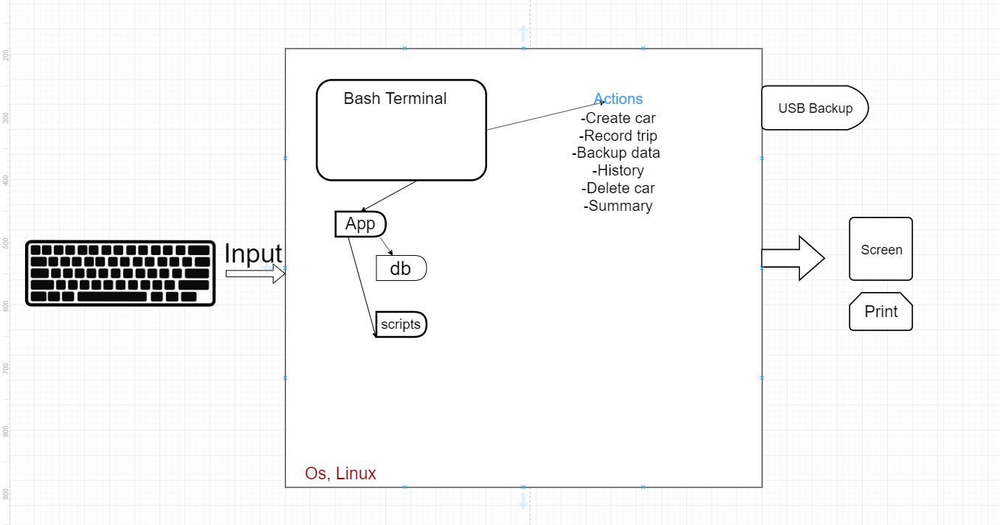

Car Rental Minimal App
===========================

A car rental management minimal app in Bash.

Contents
-----
  1. [Planning](#planning)
  1. [Design](#design)
  1. [Development](#development)
  1. [Evalution](#evaluation)

Planning
----------
** Defining the problem (topic 1.1.1) **
100-150 words explaining context of problem
A system change has to happen from handwritten records to a computer system that keeps track of car rentals
Potential problem with old system- handwritten
data loss might happen when people lose papers, access is hard because its on paper, hard to read handwriting, damage to records. takes more work to write down all the info about cars
Benefits of new system- easy to use, all info stored in one area, easy access as well as quick data entering.
Requirements requested of program
-Should be a simple terminal based program
-easy installation, as well as transparency of steps
-allow user to create new car, record trips, query trips and edit delete car information.
-Enter trip distance for car
-permanent storage system
-comandd to see total statistics
-User skill independant
-Data should be safely backed up, all trip data should go under specific car


Create a car
"$create plate model color pseats"
-Get inputs with argument
-Check number of arguments, if 4 then continue, if not exit "messagE"
-write to mainfile with one extra line, not erasing other entries
-create car trip file with license plate.txt


-------------


Design
---------
###First sketch diagram of system



Development
--------
###First install program
```sh
#!/bin/bash
#minimal Car rental app

echo "Starting the installation"

#moving to the desired location
cd ~/Desktop
echo "moving to desktop"
echo $PWD

#Check for correct change directory

#Create App folder
mkdir RentalCarApp
cd RentalCarApp
#Creatae folder for database, and script
mkdir db
mkdir scripts
echo "Structure created successfully"


#uninstall option

echo "Would you like to keep program?"
echo "Y for yes, N for no."
read choice

if [ $choice == "Y" ]; then
	echo "Program is installed."
fi

if [ $choice == "N" ]; then
	echo "Deleting program"
	cd ~/Desktop
	rm -r RentalCarApp
fi
```

Evaluation
-----------


